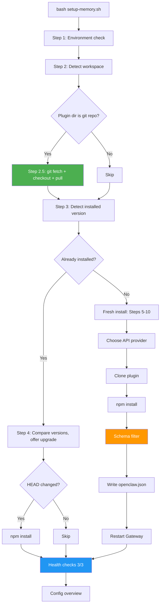

# memory-lancedb-pro Setup Script

One-click installer for the [memory-lancedb-pro](https://github.com/CortexReach/memory-lancedb-pro) plugin.

> [memory-lancedb-pro](https://github.com/CortexReach/memory-lancedb-pro) 插件的一键安装脚本，对新手友好，一个命令搞定所有事。

## Quick Start

```bash
# Download and run
curl -fsSL https://raw.githubusercontent.com/CortexReach/toolbox/main/memory-lancedb-pro-setup/setup-memory.sh -o setup-memory.sh
bash setup-memory.sh
```

Or clone the whole repo:

```bash
git clone https://github.com/CortexReach/toolbox.git
cd toolbox/memory-lancedb-pro-setup
bash setup-memory.sh
```

## What Problems Does It Solve?

> 不管你是什么情况，跑一个命令就行，脚本自动判断。

| Your situation | What the script does |
|---|---|
| Never installed | Fresh download → install deps → pick config → write to openclaw.json → restart |
| Installed via `git clone`, stuck on old commit | Auto `git fetch` + `checkout` to latest → reinstall deps → verify |
| Installed via `npm` | Skip git update, remind you to `npm update` yourself |
| Already up to date | Run health checks only, no changes |
| Config has invalid fields (the 4-field bug) | Auto-detect via schema filter, remove unsupported fields before writing |
| `openclaw` CLI broken due to invalid config | Fallback: read workspace path directly from `openclaw.json` file |
| Don't know if default branch is `main` or `master` | Auto-detect from remote |
| Plugin installed in `extensions/` instead of `plugins/` | Auto-detect from config or `find` |

> 不管你是什么情况，跑一个命令就行，脚本自动判断。

| 你的情况 | 脚本做什么 |
|---|---|
| 啥都没装过 | 全新下载 → 装依赖 → 选配置 → 写入 → 重启 |
| 之前 git clone 装的，停在旧版本 | 自动 fetch + checkout 到最新 → 重装依赖 → 检查 |
| npm 装的 | 跳过 git 更新，提示你 `npm update` |
| 已是最新 | 只跑健康检查，不改任何东西 |
| 配置有非法字段（4 字段 bug） | 按插件 schema 自动裁掉，告诉你裁了什么 |
| openclaw CLI 因配置损坏无法使用 | 兜底：直接从 JSON 文件读 workspace |
| 不知道默认分支叫 main 还是 master | 自动检测 |
| 插件装在 extensions/ 而不是 plugins/ | 自动探测 |

## Usage

```bash
bash setup-memory.sh                    # Install or upgrade / 安装或升级
bash setup-memory.sh --dry-run          # Preview only / 只预览不执行
bash setup-memory.sh --beta             # Include pre-release versions / 包含 beta 版本
bash setup-memory.sh --ref v1.2.0       # Lock to specific version / 锁定到指定版本
bash setup-memory.sh --selfcheck-only   # Capability check only / 只跑能力自检
bash setup-memory.sh --uninstall        # Revert config and remove plugin / 还原配置并移除
```

## How It Works



**Text version / 文字版：**

```
Step 1:   Environment check (node, openclaw, jq)
Step 2:   Detect workspace path (3-level fallback)
Step 2.5: Git auto-update (fetch + checkout + pull)
Step 3:   Detect installed version
Step 4:   Compare with remote, offer upgrade
─── Fresh install only ───
Step 5-7: Choose API provider + config template
Step 8:   Clone plugin (--branch $ref --depth 1)
Step 9:   npm install
Step 9.5: Schema filter (remove unsupported fields)
Step 10:  Write to openclaw.json (safe deep-merge)
─── All users ───
Restart Gateway → 3/3 health checks → config overview
```

## Key Features

### Schema Dynamic Filter (v3.1+)

The script reads the installed plugin's `openclaw.plugin.json` and filters generated config against its `configSchema`. Any field not declared in the schema (with `additionalProperties: false`) is automatically removed with a warning.

> 脚本会读取已安装插件的 schema，自动裁剪不支持的字段。之前报 `must NOT have additional properties` 的问题彻底解决。

### Version Locking (v3.1+)

```bash
bash setup-memory.sh --ref v1.1.0-beta.8   # Pin to a specific tag
bash setup-memory.sh --ref master           # Explicit branch
bash setup-memory.sh                        # Default: auto-detect remote default branch
```

### Git Auto-Update (v3.2)

If the plugin directory is a git repo (from a previous `git clone`), the script automatically:
1. Detects the remote default branch (`main` or `master`)
2. `git fetch origin`
3. `git checkout <target>` + `git pull`
4. Reinstalls npm dependencies if HEAD changed

> 之前 git clone 的用户不需要手动 fetch，脚本自动帮你更新到最新。

### Workspace Fallback (v3.2)

When `openclaw config get` fails (e.g., due to invalid config), the script falls back to:
1. Parse `openclaw.json` directly with Node.js
2. Guess common default paths (`~/.openclaw/workspace`)
3. Ask the user as last resort

### Plugin Path Auto-Detection (v3.0+)

Searches for the plugin in:
1. Registered paths in `openclaw.json` → `plugins.load.paths`
2. `find` under workspace (covers `extensions/`, `plugins/`, custom dirs)
3. Default `$WORKSPACE/plugins/memory-lancedb-pro`

### Multi-Provider Support (v3.0+)

Quick-start presets for: **Jina** / **DashScope** / **SiliconFlow** / **OpenAI** / **Ollama**

Or enter any OpenAI-compatible API endpoint manually.

## Files

| File | Description |
|------|-------------|
| `setup-memory.sh` | Main installer script (v3.2) |
| `scripts/memory-selfcheck.mjs` | Capability self-check (embedding & rerank probe) |
| `scripts/probe-endpoint.mjs` | Universal OpenAI-compatible API endpoint probe (v3.0+) |
| `scripts/config-validate.mjs` | Post-install config field validation (v3.0+) |
| `selfcheck.example.json` | Example config for self-check |

## Requirements

- Node.js v18+
- OpenClaw CLI installed
- jq (optional — enables auto config merge; without it you edit manually)

## Tested On

| OS | Terminal | Version | Result |
|----|----------|---------|--------|
| Linux (Docker arm64) | OpenClaw container | v3.2 | pass |
| macOS | Terminal / iTerm2 | v1.2+ | pass |
| Windows WSL | Windows Terminal | v1.1 | pass (older version, v3.2 not yet tested) |

## Changelog

### v3.2 (2026-03-14)
- Git auto-update: existing git repos auto `fetch` + `checkout` to target ref
- Auto-detect remote default branch (`main` vs `master`)
- Workspace fallback when `openclaw` CLI is broken by invalid config
- npm reinstall when HEAD changes after git update

### v3.1 (2026-03-14)
- `--ref` parameter: lock clone to specific tag/branch/commit
- Schema dynamic filter: remove unsupported config fields before writing
- Pre/post filter JSON validation

### v3.0 (2026-03-14)
- Universal endpoint probe for any OpenAI-compatible API
- Quick-start presets: Jina / DashScope / SiliconFlow / OpenAI / Ollama
- Post-install config validation (`config-validate.mjs`)
- Dynamic config generation (replaces hardcoded templates)
- Plugin path auto-detection (`extensions/` / `plugins/` / custom)

### v2.0 (2026-03-14)
- Upgrade path: version compare + one-click upgrade with rollback
- Config overview: read actual values from `openclaw.json`
- 20+ beginner-proof improvements

### v1.3 (2026-03-14)
- Feature awareness: show ON/OFF status after install
- Optional upgrade: enable advanced features interactively

### v1.2 (2026-03-13)
- Fix: mktemp macOS compatibility

### v1.1 (2026-03-13)
- Fix: plugin path from relative to absolute
